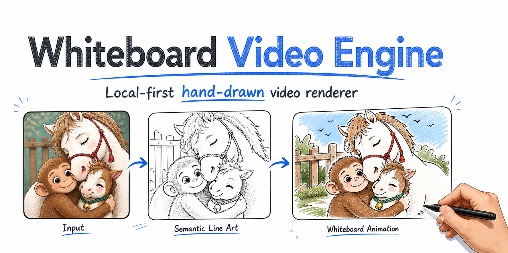

<p align="center">
  
</p>

# Codex Whiteboard Video Skill

[中文](README.md)

<p>
  
  
  
</p>

Codex Skill adapter for [whiteboard-video-engine](https://github.com/gnipbao/whiteboard-video-engine). It lets Codex call the installed engine to generate local whiteboard animation videos from images, SVGs, line art, or scripts, with 30 built-in visual styles that can be selected, recommended, or extended.

This repository contains the Skill instructions and a thin CLI wrapper only. Rendering, model providers, stroke tracing, and video composition live in the engine repository.

## Repository Split

| Repository | Responsibility |
| --- | --- |
| [whiteboard-video-engine](https://github.com/gnipbao/whiteboard-video-engine) | Python package, renderer, CLI, model wrappers, tests, docs |
| [codex-whiteboard-video-skill](https://github.com/gnipbao/codex-whiteboard-video-skill) | Codex `SKILL.md`, workflow references, wrapper script |

## Demo

The full demo assets are maintained in the engine repository.

<table>
  <tr>
    <td width="50%">
      <strong>Input</strong><br>
      
    </td>
    <td width="50%">
      <strong>Output Preview</strong><br>
      <a href="https://github.com/gnipbao/whiteboard-video-engine/blob/main/examples/cases/sports-illustration-anime2sketch/output.mp4">
        
      </a><br>
      <a href="https://github.com/gnipbao/whiteboard-video-engine/blob/main/examples/cases/sports-illustration-anime2sketch/output.mp4">Open MP4</a>
    </td>
  </tr>
</table>

## Installation

Install the engine first:

```bash
python3 -m pip install "git+https://github.com/gnipbao/whiteboard-video-engine.git"
```

Install the Skill:

```bash
mkdir -p ~/.codex/skills
git clone https://github.com/gnipbao/codex-whiteboard-video-skill.git \
  ~/.codex/skills/whiteboard-video
```

Verify the wrapper:

```bash
python3 ~/.codex/skills/whiteboard-video/scripts/whiteboard_cli.py doctor
```

For local engine development:

```bash
python3 -m pip install -e /path/to/whiteboard-video-engine
```

## Usage in Codex

Mention the installed Skill:

```text
[$whiteboard-video](/Users/you/.codex/skills/whiteboard-video/SKILL.md)
Convert this image into a 15-second whiteboard animation with rich stroke detail and the asian hand cursor.
```

The wrapper delegates to the installed engine:

```bash
python3 "${CODEX_HOME:-$HOME/.codex}/skills/whiteboard-video/scripts/whiteboard_cli.py" render-photo input.jpg \
  -o out/output.mp4 \
  --duration 15 \
  --lineart-provider auto \
  --stroke-detail rich
```

Always use the installed Skill's absolute wrapper path shown above. Do not call a project-local `whiteboard-video/scripts/whiteboard_cli.py`; stale copies may prepend a bundled `src` directory and shadow the latest installed engine defaults.

## Visual Styles

The engine provides 30 versioned styles named for media, materials, and
production methods. A style does more than append prompt text: it controls the
actual color-fill material, stroke detail, line width, line-art snap, natural
block count, overlap, and ordering. The resolved recipe and optional `--theme`
are stored in the `project.json` style snapshot and participate in planning and
resume fingerprints.

Style-selection arguments belong only to `plan-script` and `run`: planning uses
the semantic prompt fields, while `run` also inherits the recipe's renderer
settings. `render-photo` / `render-image` reject style selectors and do not
inherit a recipe. Their fixed single-image defaults include
`--line-thickness 0`, `--stroke-detail rich`, `--block-fill-style crayon`, and
`--block-overlap 0.08`.

Whiteboard compatibility groups:

- `native` (15): `warm-crayon-storybook`, `colored-pencil-diary`,
  `clean-whiteboard`, `minimal-line-explainer`, `marker-whiteboard`,
  `rough-diagram`, `pressure-ink-notes`, `semantic-ink`, `anime-graphite`,
  `bean-doodle-infographic`, `organic-contour-doodle`, `naive-marker-notes`,
  `notebook-pencil-doodle`, `inked-storybook`, `blueprint-pencil`.
- `adaptive` (9): `kid-crayon`, `raw-kid-crayon`,
  `emotional-watercolor-sketch`, `ink-wash-minimal`, `retro-gouache-concept`,
  `nordic-gouache-storybook`, `sunlit-storybook`, `editorial-portrait`,
  `real-crayon-paper`.
- `experimental` (6): `ballpoint-scribble`, `warm-flat-storybook`,
  `zine-riso-collage`, `manga-screentone`, `linocut-editorial`,
  `ms-paint-doodle`.

Use `native` for the most predictable unattended production. Preview
`adaptive` recipes first; dense texture, black masses, or weak contours make
`experimental` results more source-dependent. The stable default is
`warm-crayon-storybook`, also configurable with `WHITEBOARD_STYLE`.

```bash
CLI="${CODEX_HOME:-$HOME/.codex}/skills/whiteboard-video/scripts/whiteboard_cli.py"
python3 "$CLI" list-styles
python3 "$CLI" list-styles --compatibility native
python3 "$CLI" list-styles --json
python3 "$CLI" recommend-styles story.md --limit 5
python3 "$CLI" recommend-styles story.md --limit 5 --json
```

For a new script-to-story task, the Skill should inspect local recommendations
first without forcing the user through a 30-option approval step every time.
Honor a named style directly; pass `--style auto` when selection is delegated;
otherwise keep the stable default, or choose one clearly better `native`
recommendation when the subject makes that choice obvious, and briefly report it.

```bash
python3 "$CLI" run story.md -o out/story.mp4 --style colored-pencil-diary
python3 "$CLI" run story.md -o out/story.mp4 --style auto
python3 "$CLI" run story.md -o out/story.mp4 \
  --custom-style "Loose blue-pencil travel sketch, one warm-orange accent, broad white space"
python3 "$CLI" run story.md -o out/story.mp4 \
  --custom-style-file /absolute/path/to/style.json \
  --theme "Quiet early morning with restrained optimism"
```

Custom JSON can inherit a stable recipe with `extends` and override only the
needed fields:

```json
{
  "extends": "colored-pencil-diary",
  "id": "custom-blue-pencil-travel",
  "name_zh": "蓝铅笔旅行日记",
  "name_en": "Blue-pencil travel diary",
  "palette": "Prussian blue and dusty cyan with one warm-orange accent",
  "render": {
    "block_fill_style": "dry-brush",
    "stroke_detail": "rich",
    "draw_blocks": 3
  }
}
```

`--style`, `--custom-style`, and `--custom-style-file` are mutually exclusive;
`--theme` can accompany any one of them. Recipes contain text and numeric
parameters only: they do not embed or fetch third-party samples, artist
reference boards, or brushes, and built-in styles are not named after artists.
See [references/pipeline.md](references/pipeline.md) for the full workflow and
JSON boundaries.

An explicit custom JSON `id` must begin with `custom-`. Do not provide
`provenance`: it is not a user-writable schema field, and the engine marks the
loaded recipe as user-authored. For `run`, the following options override the
style snapshot only when explicitly supplied; otherwise the recipe remains in
control:

- `--block-fill-style crayon|clean|soft-wash|dry-brush`
- `--stroke-detail balanced|rich|max` and `--line-thickness 0..16`
- `--line-art-snap` / `--no-line-art-snap` and
  `--line-art-snap-threshold 1..254`
- `--max-draw-blocks N`, `--draw-blocks N` (or `0` for automatic
  grouping), `--block-overlap 0..0.65`, and `--block-order reading|source`
- `--block-sequence 1,0,...` (an explicit run-time order, not a recipe field)

The single-image commands instead spell their snap controls
`--no-lineart-snap` and `--lineart-snap-threshold`; do not mix those with the
hyphenated `run` forms.

## Local Models

The Skill uses the engine provider system. Model code and weights are not included here.

Put models in the project directory where Codex runs the command. Do not put model repositories or weights inside `~/.codex/skills/whiteboard-video`.

Recommended layout:

```text
my-whiteboard-project/
  .venv-lineart/
    bin/
      python
  tools/
    lineart/
      run_informative_drawings.py
      run_anime2sketch.py
    informative-drawings/              # full upstream repository clone required
      test.py
      model.py
      data.py
      util/
      checkpoints/
        model/
          anime_style/
            netG_A_latest.pth
          contour_style/
            netG_A_latest.pth        # optional
          opensketch_style/
            netG_A_latest.pth        # optional
    Anime2Sketch/                      # full upstream repository clone required
      model.py
      data.py
      utils.py
      weights/
        netG.pth
        improved.bin                 # optional; preferred when available
```

`tools/informative-drawings/` and `tools/Anime2Sketch/` must be complete upstream project checkouts, not empty folders that only contain weights. The engine wrapper imports Python modules from those repositories; keeping only `*.pth` / `*.bin` files is not enough.

Minimum valid setups:

- Informative Drawings: `tools/lineart/run_informative_drawings.py` plus `tools/informative-drawings/checkpoints/model/anime_style/netG_A_latest.pth`.
- Anime2Sketch: `tools/lineart/run_anime2sketch.py` plus `tools/Anime2Sketch/weights/netG.pth` or `tools/Anime2Sketch/weights/improved.bin`.

You can also set explicit commands:

```bash
export WHITEBOARD_INFORMATIVE_DRAWINGS_CMD="/abs/project/.venv-lineart/bin/python /abs/project/tools/lineart/run_informative_drawings.py {input} {output}"
export WHITEBOARD_ANIME2SKETCH_CMD="/abs/project/.venv-lineart/bin/python /abs/project/tools/lineart/run_anime2sketch.py {input} {output}"
```

See the engine model guide: [whiteboard-video-engine/docs/MODELS.md](https://github.com/gnipbao/whiteboard-video-engine/blob/main/docs/MODELS.md).

## Contents

- `SKILL.md`: Codex instructions.
- `scripts/whiteboard_cli.py`: wrapper around the installed engine CLI.
- `references/`: workflow notes.
- `examples/`: lightweight examples and case notes.

## Not Included

- engine source code
- model repositories
- model weights
- generated videos
- user uploads

## License

MIT. Upstream model code and weights keep their own licenses.
